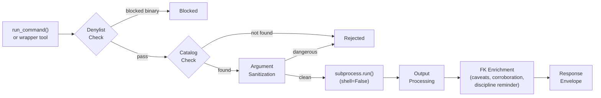
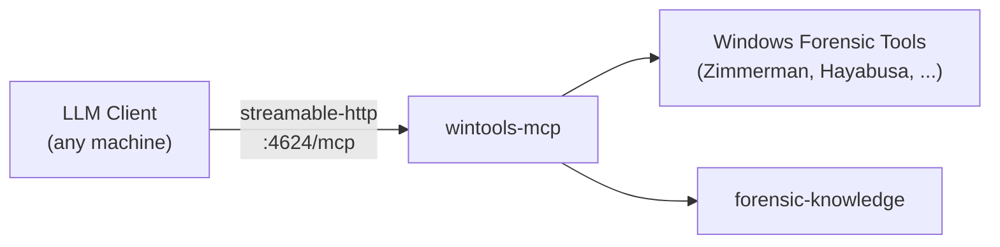
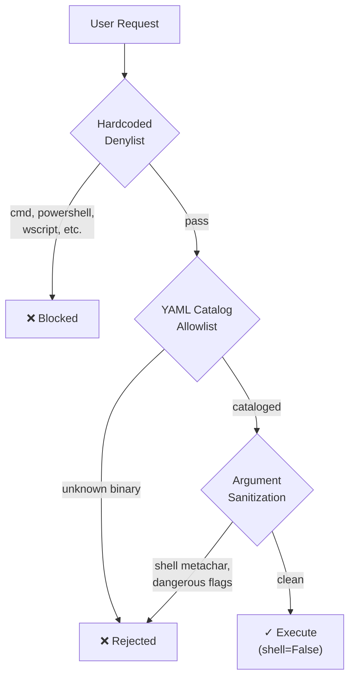

# Windows Tools MCP Server

A Model Context Protocol (MCP) server providing **Windows forensic tool execution with proactive artifact knowledge** for any MCP-compatible AI assistant. Designed for Windows forensic workstations.

## Installation Options

### Option A: As Part of AIR (Recommended)

This MCP is designed as a component of the AIR (Applied Incident Response) platform.

```bash
git clone https://github.com/AppliedIR/wintools-mcp.git
cd wintools-mcp
python -m venv .venv && .venv\Scripts\activate
pip install -e ".[fk,dev]"
```

Requires [forensic-knowledge](https://github.com/AppliedIR/forensic-knowledge) (installed with the `[fk]` extra).

### Option B: Standalone Installation

Use standalone when you need Windows forensic tool execution without the full AIR platform.

See the **Quick Start** section below.

---

## Overview

This server wraps Windows forensic tool execution with catalog-based gating, audit trails, and knowledge-enriched response envelopes. Every tool response includes artifact-specific caveats, corroboration suggestions, and rotating discipline reminders drawn from the forensic-knowledge package.

> **Important:** All commands are executed via `subprocess.run(shell=False)` through a catalog-gated executor. Only tools defined in the catalog can be executed. Dangerous binaries (cmd, powershell, wscript, etc.) are unconditionally blocked by a hardcoded denylist.

**Key Capabilities:**

- **Catalog-Gated Execution** - Only tools defined in YAML catalog files can run; dangerous binaries are denylisted
- **Knowledge-Enriched Responses** - Every result includes artifact caveats, false positive context, corroboration suggestions, and field notes from forensic-knowledge
- **Discipline Reminders** - Rotating forensic methodology reminders appended to responses
- **Tool Discovery** - Scan for installed tools, check availability, get install guidance for missing tools
- **Output Management** - Automatic truncation, SHA-256 hashing, per-evidence output directories
- **Audit Trail** - Per-case JSONL audit when `AIIR_CASE_DIR` is set

## MCP Tools

### Discovery (6 tools)

| Tool | Description |
|------|-------------|
| `scan_tools` | Scan for all cataloged forensic tools, report availability and install guidance |
| `list_available_tools` | List all cataloged tools with installation status |
| `list_missing_tools` | List tools not installed, with installation guidance and alternatives |
| `check_tools` | Check specific tools for availability |
| `get_tool_help` | Get tool-specific help, flags, caveats, and interpretation guidance |
| `suggest_tools` | Given an artifact type, suggest relevant tools and check availability |

### Generic Execution (1 tool)

| Tool | Description |
|------|-------------|
| `run_command` | Execute any cataloged tool with arguments. Catalog-gated: rejects commands not in the catalog. |

### Zimmerman Suite Wrappers (14 tools)

| Tool | Description |
|------|-------------|
| `run_amcacheparser` | Parse Amcache.hve for program execution evidence |
| `run_appcompatcacheparser` | Parse Application Compatibility Cache (ShimCache) from SYSTEM hive |
| `run_evtxecmd` | Parse Windows Event Log (EVTX) files |
| `run_jlecmd` | Parse Jump List files for recent file access |
| `run_lecmd` | Parse LNK (shortcut) files |
| `run_mftecmd` | Parse MFT ($MFT, $J, $SDS, $Boot) files |
| `run_pecmd` | Parse Prefetch files for program execution history |
| `run_rbcmd` | Parse Recycle Bin ($I) files |
| `run_recmd` | Parse Windows Registry hive files |
| `run_sbecmd` | Parse ShellBags for folder access history |
| `run_sqlecmd` | Parse SQLite databases (browser history, etc.) |
| `run_srumecmd` | Parse SRUM database for resource usage monitoring |
| `run_wxtcmd` | Parse Windows Timeline (ActivitiesCache.db) database |
| `run_bstrings` | Extract strings with regex pattern matching |

### Timeline Wrappers (2 tools)

| Tool | Description |
|------|-------------|
| `run_hayabusa` | Run Hayabusa for Sigma-based Windows event log analysis |
| `run_mactime` | Generate timeline from bodyfile (TSK mactime format) |

## Response Envelope

Every successful tool response is wrapped in a structured envelope:

```json
{
  "success": true,
  "tool": "run_amcacheparser",
  "data": "...",
  "output_format": "parsed_csv",
  "evidence_id": "win-steve-20260220-001",
  "examiner": "steve",
  "caveats": [
    "Amcache entries indicate installation, not necessarily execution",
    "Timestamps reflect installation time, not last run"
  ],
  "advisories": ["Cross-reference with Prefetch for execution confirmation"],
  "corroboration": {
    "artifacts": ["prefetch", "shimcache"],
    "tools": ["PECmd", "AppCompatCacheParser"]
  },
  "discipline_reminder": "Evidence is sovereign — if results conflict with your hypothesis, revise the hypothesis",
  "metadata": {
    "elapsed_seconds": 1.23,
    "exit_code": 0,
    "command": ["AmcacheParser.exe", "-f", "Amcache.hve", "--csv", "C:\\Cases\\output"]
  }
}
```

| Field | Description |
|-------|-------------|
| `evidence_id` | Unique identifier (`win-{examiner}-{YYYYMMDD}-{NNN}`) for referencing in case findings |
| `caveats` | Artifact-specific limitations from forensic-knowledge |
| `advisories` | Usage guidance and workflow tips from forensic-knowledge |
| `corroboration` | Suggested cross-references for validation |
| `discipline_reminder` | Rotating forensic methodology reminder |

## Security Model

### Denylist (hardcoded, unconditional)

The following binaries are blocked regardless of catalog status:

```
cmd, powershell, pwsh, wscript, cscript, mshta, rundll32, regsvr32,
certutil, bitsadmin, msiexec, bash, wsl, sh  (and .exe variants)
```

### Allowlist (catalog-gated)

After passing the denylist, a binary must exist in the YAML catalog. Unknown binaries are rejected.

### Argument Sanitization

All user-provided arguments are checked for shell metacharacters (`;`, `&&`, `||`, `` ` ``, `$(`, `${`) and dangerous flags (`-e`, `--exec`, `--command`, `-enc`, `-encodedcommand`).

All execution uses `subprocess.run(shell=False)`.

## Tool Catalog

Tools are defined in YAML catalog files under `data/catalog/`:

```yaml
# data/catalog/zimmerman.yaml
category: zimmerman
tools:
  - name: AmcacheParser
    binary: AmcacheParser.exe
    description: "Parse Amcache.hve for application execution history"
    input_flag: "-f"
    output_format: csv
    timeout_seconds: 300
    fk_tool_name: amcacheparser
    install_methods:
      - method: dotnet
        command: "dotnet tool install --global AmcacheParser"
    install_paths:
      - "C:\\Tools\\ZimmermanTools"
```

**Catalog files:** `zimmerman.yaml` (14 tools), `timeline.yaml` (2 tools)

## Configuration

### Environment Variables

| Variable | Default | Description |
|----------|---------|-------------|
| `WINTOOLS_TIMEOUT` | `600` | Default command timeout in seconds |
| `WINTOOLS_HOST` | `127.0.0.1` | HTTP server bind address |
| `WINTOOLS_PORT` | `4624` | HTTP server port |
| `WINTOOLS_TOOL_PATHS` | (none) | Additional binary search directories (path-separated) |
| `WINTOOLS_CATALOG_DIR` | (auto) | Override path to catalog YAML directory |
| `AIIR_CASE_DIR` | (none) | Active case directory; enables per-case audit trail |
| `AIIR_EXAMINER` | OS user | Examiner identity (slug format, immutable after startup) |
| `AIIR_ANALYST` | (none) | Deprecated alias for `AIIR_EXAMINER` |

### YAML Config File

Pass via `--config path/to/config.yaml`. Environment variables override YAML values.

| Key | Default | Description |
|-----|---------|-------------|
| `default_timeout` | `600` | Subprocess timeout in seconds |
| `max_output_bytes` | `50000` | Output truncation threshold |
| `http_host` | `127.0.0.1` | HTTP bind address |
| `http_port` | `4624` | HTTP port |
| `hayabusa_dir` | `C:\Tools\Hayabusa` | Hayabusa installation directory |
| `tool_paths` | `[]` | Additional binary search directories |
| `api_keys` | `{}` | API keys for HTTP mode authentication |

### Binary Search Order

1. System PATH (`shutil.which`)
2. Default tool paths: `C:\Tools`, `C:\Tools\ZimmermanTools`, `C:\Tools\Hayabusa`, `C:\Tools\SleuthKit\bin`, `C:\Tools\KAPE`, Chocolatey bin, Scoop shims
3. Extra paths from `WINTOOLS_TOOL_PATHS` or `tool_paths` config

## Quick Start

```bash
git clone https://github.com/AppliedIR/wintools-mcp.git
cd wintools-mcp
python -m venv .venv && .venv\Scripts\activate
pip install -e ".[fk]"
```

**Scan for installed tools:**

```bash
python -m wintools_mcp --scan
```

**MCP Configuration** (add to `.mcp.json`):

```json
{
  "mcpServers": {
    "wintools-mcp": {
      "command": "C:\\path\\to\\wintools-mcp\\.venv\\Scripts\\python.exe",
      "args": ["-m", "wintools_mcp"],
      "env": {
        "AIIR_CASE_DIR": "Z:\\Cases\\INC-2026-0001",
        "AIIR_EXAMINER": "steve"
      }
    }
  }
}
```

**Verify installation:**

```bash
python -c "from wintools_mcp.server import create_server; print('wintools-mcp: ready')"
```

## Case Audit Trail

When `AIIR_CASE_DIR` is set, every tool execution is logged to `examiners/{examiner}/audit/wintools-mcp.jsonl`:

```json
{"ts": "2026-02-20T14:30:00Z", "mcp": "wintools-mcp", "tool": "run_amcacheparser", "evidence_id": "win-steve-20260220-001", "examiner": "steve", "params": {"input_file": "Amcache.hve"}}
```

## Project Structure

```
wintools-mcp/
├── src/wintools_mcp/
│   ├── __init__.py
│   ├── __main__.py             # Entry point
│   ├── server.py               # FastMCP server registration
│   ├── catalog.py              # Tool catalog loading and validation
│   ├── config.py               # Configuration management
│   ├── environment.py          # Binary discovery and path searching
│   ├── security.py             # Argument sanitization
│   ├── response.py             # FK-enriched response envelope builder
│   ├── output.py               # Output directory and manifest management
│   ├── audit.py                # Per-case JSONL audit writer
│   ├── http_server.py          # Streamable HTTP server (Starlette + auth)
│   └── tools/                  # Tool-specific wrappers
│       ├── discovery.py        # scan_tools, list_available_tools, check_tools, suggest_tools
│       ├── generic.py          # run_command (catalog-gated)
│       ├── zimmerman.py        # Zimmerman suite wrappers (14 tools)
│       └── timeline.py         # hayabusa, mactime
├── data/catalog/               # Tool catalog YAML files
│   ├── zimmerman.yaml          # 14 Zimmerman tools
│   └── timeline.yaml           # Hayabusa, mactime
├── tests/                      # 121 tests
├── pyproject.toml
└── README.md
```

## Development

```bash
# Run tests
.venv\Scripts\pytest tests/ -v

# Run with coverage
.venv\Scripts\pytest tests/ --cov=wintools_mcp --cov-report=term-missing
```

## Architecture

### Execution Pipeline

Every tool execution flows through the same security and enrichment pipeline.



### Connection Modes

LLM clients connect to wintools-mcp via Streamable HTTP. The server runs on the Windows forensic workstation and listens on port 4624.



### HTTP Mode

Start wintools-mcp as an HTTP server for remote access:

```bash
python -m wintools_mcp --http --host 0.0.0.0 --port 4624
```

The HTTP server exposes:
- `/mcp` — MCP Streamable HTTP endpoint (for LLM clients)
- `/health` — Health check

Configure your LLM client: `aiir setup client --windows=WIN_IP:4624`

### Security Model



## Responsible Use

This tool is designed to assist trained forensic analysts, not replace them. Tool execution results require the same verification as any other forensic tool output.

**Core principles:**

- **Human authority is final.** Every finding and conclusion must be reviewed and approved by a qualified analyst before it becomes part of the case record.
- **Evidence before claims.** All conclusions must reference actual evidence. Unsupported claims are structurally rejected by the platform.
- **The analyst owns the work product.** AI assistance does not reduce the analyst's responsibility for accuracy, completeness, or defensibility of conclusions.
- **AI output requires the same scrutiny as any other tool.** Treat AI-proposed findings the same way you would treat output from any forensic tool: verify, corroborate, and document.
- **Absence of evidence is not evidence of absence.** The platform guards against premature exclusion and confirmation bias, but the human analyst is the last line of defense.

## Acknowledgments

Architecture and direction by Steve Anson. Implementation by Claude Code (Anthropic).

## License

MIT License. See [LICENSE](LICENSE) for details.
