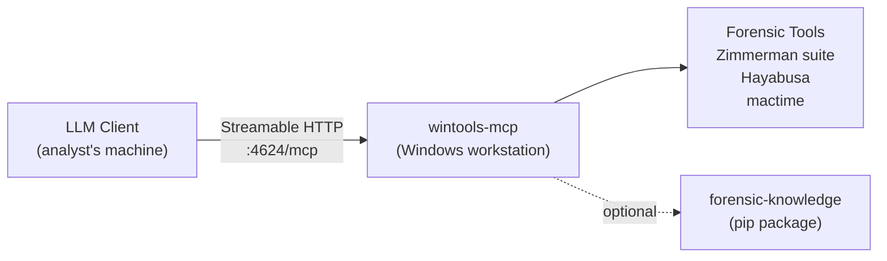
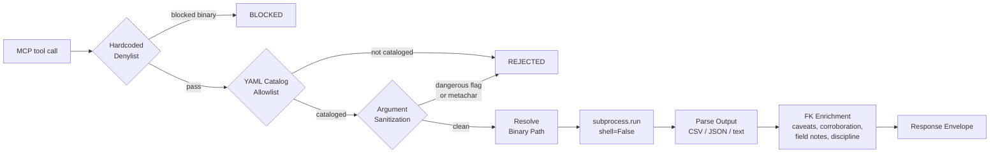
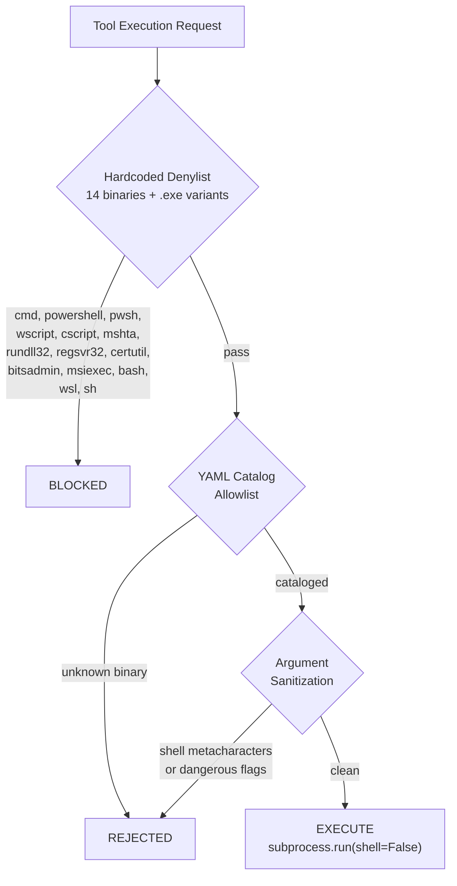

# Windows Tools MCP

Catalog-gated Windows forensic tool execution with knowledge-enriched response envelopes.

## Architecture

wintools-mcp runs independently on a Windows forensic workstation, exposing a Streamable HTTP endpoint on port 4624. LLM clients connect directly -- no gateway involved.



### Execution Pipeline

Every tool execution flows through the same security and enrichment pipeline.



### Security Model



All execution uses `subprocess.run(shell=False)`. Only tools defined in YAML catalog files can run. Dangerous binaries (cmd, powershell, wscript, etc.) are unconditionally blocked by a hardcoded denylist. Arguments are checked for shell metacharacters and dangerous flags.

## Quick Start

On the Windows forensic workstation:

```powershell
git clone https://github.com/AppliedIR/aiir.git; cd aiir
.\scripts\setup-windows.ps1
```

The installer clones wintools-mcp, installs dependencies, scans for forensic tools, starts the HTTP server on port 4624, and optionally configures auto-start.

Then on the analyst's machine, configure your LLM client:

```bash
aiir setup client --windows=WIN_IP:4624
```

This writes the appropriate MCP configuration entry for your client (Claude Code, Cursor, Goose, OpenCode, etc.) pointing at the Windows workstation's Streamable HTTP endpoint.

## MCP Tools (23 total)

### Discovery (6 tools)

| Tool | Description |
|------|-------------|
| `scan_tools` | Scan for all cataloged forensic tools, report availability and install guidance |
| `list_available_tools` | List all cataloged tools with installation status, filterable by category |
| `list_missing_tools` | List tools not installed, with installation guidance and alternatives |
| `check_tools` | Check specific tools by name for availability |
| `get_tool_help` | Get tool-specific help, flags, caveats, and interpretation guidance |
| `suggest_tools` | Given an artifact type, suggest relevant tools and check availability |

### Generic Execution (1 tool)

| Tool | Description |
|------|-------------|
| `run_command` | Execute any cataloged tool with arguments (catalog-gated) |

### Zimmerman Suite Wrappers (14 tools)

Each wrapper resolves the binary, builds the command with `--csv` output, executes via the security pipeline, parses resulting CSV files, and returns an FK-enriched response envelope.

| Tool | Description |
|------|-------------|
| `run_amcacheparser` | Parse Amcache.hve for program execution evidence |
| `run_appcompatcacheparser` | Parse Application Compatibility Cache (ShimCache) |
| `run_evtxecmd` | Parse Windows Event Log (EVTX) files |
| `run_jlecmd` | Parse Jump List files for recent file access |
| `run_lecmd` | Parse LNK (shortcut) files |
| `run_mftecmd` | Parse MFT ($MFT, $J, $SDS, $Boot) files |
| `run_pecmd` | Parse Prefetch files for program execution history |
| `run_rbcmd` | Parse Recycle Bin ($I) files |
| `run_recmd` | Parse Windows Registry hive files |
| `run_sbecmd` | Parse ShellBags for folder access history |
| `run_sqlecmd` | Parse SQLite databases (browser history, etc.) |
| `run_srumecmd` | Parse SRUM database for resource usage monitoring |
| `run_wxtcmd` | Parse Windows Timeline (ActivitiesCache.db) |
| `run_bstrings` | Extract strings with regex pattern matching |

### Timeline Wrappers (2 tools)

| Tool | Description |
|------|-------------|
| `run_hayabusa` | Sigma-based Windows event log analysis |
| `run_mactime` | Generate timeline from bodyfile (TSK mactime format) |

## Tool Catalog

Tools are defined in YAML catalog files under `data/catalog/`. The catalog currently contains **16 tool entries** across 2 files:

- `zimmerman.yaml` -- 14 tools (AmcacheParser, AppCompatCacheParser, EvtxECmd, JLECmd, LECmd, MFTECmd, PECmd, RBCmd, RECmd, SBECmd, SQLECmd, SrumECmd, WxTCmd, bstrings)
- `timeline.yaml` -- 2 tools (Hayabusa, mactime)

Each entry defines the binary name, input style, output format, timeout, FK knowledge name, install methods, and search paths:

```yaml
# data/catalog/zimmerman.yaml (excerpt)
category: zimmerman
tools:
  - name: AmcacheParser
    binary: AmcacheParser.exe
    description: "Parse Amcache.hve for program execution evidence"
    input_flag: "-f"
    output_format: csv
    timeout_seconds: 300
    fk_tool_name: AmcacheParser
    install_methods:
      - method: direct
        url: "https://ericzimmerman.github.io/#!index.md"
      - method: dotnet
        command: "dotnet tool install --global AmcacheParser"
    install_paths:
      - "C:\\Tools\\ZimmermanTools"
```

## Response Envelope

Every tool response is wrapped in a structured envelope with forensic-knowledge enrichment:

```json
{
  "success": true,
  "tool": "run_amcacheparser",
  "data": {"Amcache_UnassociatedFileEntries": {"rows": ["..."], "total_rows": 42}},
  "output_format": "parsed_csv",
  "evidence_id": "win-steve-20260220-001",
  "examiner": "steve",
  "caveats": [
    "Amcache entries indicate installation, not necessarily execution",
    "Timestamps reflect installation time, not last run"
  ],
  "advisories": ["Cross-reference with Prefetch for execution confirmation"],
  "corroboration": {
    "artifacts": ["prefetch", "shimcache"],
    "tools": ["PECmd", "AppCompatCacheParser"]
  },
  "field_notes": {"KeyLastWriteTimestamp": "Last time the registry key was modified"},
  "discipline_reminder": "Evidence is sovereign -- if results conflict with your hypothesis, revise the hypothesis, never reinterpret evidence to fit"
}
```

| Field | Source | Description |
|-------|--------|-------------|
| `evidence_id` | Audit | Unique identifier (`win-{examiner}-{YYYYMMDD}-{NNN}`) |
| `caveats` | forensic-knowledge | Artifact-specific limitations and interpretation warnings |
| `advisories` | forensic-knowledge | Usage guidance and common misinterpretation corrections |
| `corroboration` | forensic-knowledge | Suggested cross-reference artifacts and tools |
| `field_notes` | forensic-knowledge | Timestamp field meanings from artifact definitions |
| `discipline_reminder` | Built-in | Rotating forensic methodology reminder (10 total, cycled per call) |

## Configuration

### Environment Variables

| Variable | Default | Description |
|----------|---------|-------------|
| `WINTOOLS_TIMEOUT` | `600` | Default command timeout in seconds |
| `WINTOOLS_HOST` | `127.0.0.1` | HTTP server bind address |
| `WINTOOLS_PORT` | `4624` | HTTP server port |
| `WINTOOLS_TOOL_PATHS` | (none) | Additional binary search directories (path-separated) |
| `WINTOOLS_CATALOG_DIR` | (auto) | Override path to catalog YAML directory |
| `AIIR_CASE_DIR` | (none) | Active case directory; enables per-case audit trail |
| `AIIR_ACTIVE_CASE` | (none) | Case identifier recorded in audit entries |
| `AIIR_EXAMINER` | OS user | Examiner identity (lowercase slug) |

### YAML Config File

Pass via `--config path/to/config.yaml`. Environment variables override YAML values.

| Key | Default | Description |
|-----|---------|-------------|
| `default_timeout` | `600` | Subprocess timeout in seconds |
| `max_output_bytes` | `50000` | Output truncation threshold |
| `http_host` | `127.0.0.1` | HTTP bind address |
| `http_port` | `4624` | HTTP port |
| `hayabusa_dir` | `C:\Tools\Hayabusa` | Hayabusa installation directory |
| `tool_paths` | `[]` | Additional binary search directories |
| `api_keys` | `{}` | API keys for Bearer token authentication |

### Audit Trail

When `AIIR_CASE_DIR` is set, every tool execution is logged to `examiners/{examiner}/audit/wintools-mcp.jsonl`. Evidence IDs follow the format `win-{examiner}-{YYYYMMDD}-{NNN}` and resume sequence numbering across process restarts.

## Responsible Use

This project is intended for authorized incident response, forensic analysis, and educational purposes. Users are responsible for ensuring their use complies with applicable laws, regulations, and organizational policies. Do not use these tools against systems or data you are not authorized to access.

## Acknowledgments

Architecture and direction by Steve Anson. Implementation by Claude Code (Anthropic).

## License

MIT License - see [LICENSE](LICENSE)
