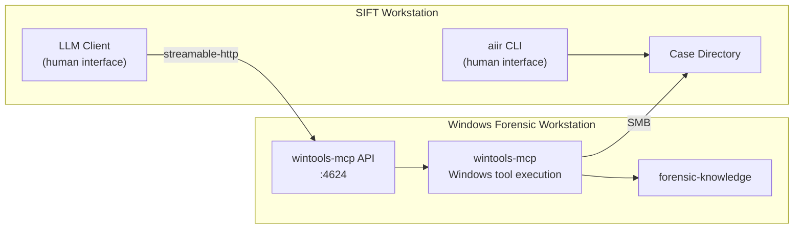
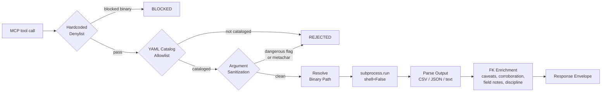
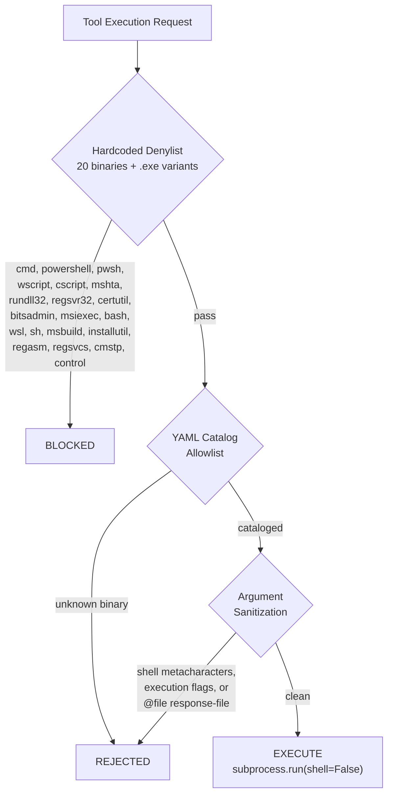

# Windows Tools MCP
[](https://github.com/AppliedIR/wintools-mcp/actions/workflows/ci.yml)
[](https://github.com/AppliedIR/wintools-mcp/blob/main/LICENSE)

Catalog-gated Windows forensic tool execution with knowledge-enriched response envelopes.

**[Platform Documentation](https://appliedir.github.io/aiir/)** ·
[Deployment Guide](https://appliedir.github.io/aiir/deployment/)

> **Public Beta** — This project is undergoing active feature development.
> Backward compatibility with future releases is not guaranteed. Consider
> this a public beta for feature testing and evaluation rather than a
> production-ready tool for real case data.

## Architecture

wintools-mcp runs independently on a Windows forensic workstation, exposing a Streamable HTTP endpoint on port 4624. The LLM client and aiir CLI are the two human-facing tools. The aiir CLI always runs on the SIFT workstation — it requires direct filesystem access to the case directory. When the LLM client runs on a separate machine, the examiner must have SSH access to SIFT for all CLI operations. The LLM client connects to wintools-mcp over the network.



### Execution Pipeline

Every tool execution flows through the same security and enrichment pipeline.



### Security Model

**This MCP opens attack vectors where connected LLM clients can execute tools on this system.** It must only be installed on dedicated forensic workstations that are isolated behind firewalls on a trusted network segment. Never install on personal laptops, production systems, or machines containing data outside the scope of the investigation.

The installer requires typing `security_hole` or passing `-AcknowledgeSecurityHole` before proceeding. This is an intentional friction point.

The additional controls in place (catalog allowlists, denylist of dangerous binaries, argument sanitization, `shell=False` execution) are defense-in-depth measures, not preventative controls. The MCP is not hardened and should never be deployed facing the Internet or other untrusted systems.



All execution uses `subprocess.run(shell=False)`. Only tools defined in YAML catalog files can run. Dangerous binaries (cmd, powershell, wscript, etc.) are unconditionally blocked by a hardcoded denylist. Arguments are checked for shell metacharacters, dangerous flags (execution-related: `-e`, `--exec`, `--command`, `-enc`), and response-file syntax (`@filename`).

## Quick Start

On the Windows forensic workstation, clone the repo:

```powershell
git clone https://github.com/AppliedIR/wintools-mcp.git; cd wintools-mcp
```

Or if git is not installed, download and extract the ZIP:

```powershell
Invoke-WebRequest https://github.com/AppliedIR/wintools-mcp/archive/refs/heads/main.zip -OutFile wintools.zip
Expand-Archive wintools.zip -DestinationPath . -Force; cd wintools-mcp-main
```

Then run the installer:

```powershell
.\scripts\setup-windows.ps1
```

See [SETUP.md](SETUP.md) for detailed deployment options and SMB configuration.

## MCP Tools (7 total)

### Discovery (6 tools)

| Tool | Description |
|------|-------------|
| `scan_tools` | Scan for all cataloged forensic tools, report availability and install guidance |
| `list_available_tools` | List all cataloged tools with installation status, filterable by category |
| `list_missing_tools` | List tools not installed, with installation guidance and alternatives |
| `check_tools` | Check specific tools by name for availability |
| `get_tool_help` | Get tool-specific help, flags, caveats, and interpretation guidance |
| `suggest_tools` | Given an artifact type, suggest relevant tools and check availability |

### Generic Execution (1 tool)

| Tool | Description |
|------|-------------|
| `run_command` | Execute any cataloged tool with arguments (catalog-gated) |

All per-tool wrappers (Zimmerman suite, Hayabusa, mactime) are consolidated into `run_command`. The tool catalog still defines each binary's input flags, output format, and FK knowledge mapping.

## Tool Catalog

Tools are defined in YAML catalog files under `data/catalog/`. The catalog currently contains **31 tool entries** across 7 files:

- `zimmerman.yaml` -- 14 tools (AmcacheParser, AppCompatCacheParser, EvtxECmd, JLECmd, LECmd, MFTECmd, PECmd, RBCmd, RECmd, SBECmd, SQLECmd, SrumECmd, WxTCmd, bstrings)
- `sysinternals.yaml` -- 5 tools (autorunsc, sigcheck, strings, handle, procdump)
- `memory.yaml` -- 4 tools (winpmem, dumpit, moneta, hollows_hunter)
- `timeline.yaml` -- 3 tools (Hayabusa, chainsaw, mactime)
- `analysis.yaml` -- 3 tools (capa, yara, densityscout)
- `collection.yaml` -- 1 tool (KAPE)
- `scripts.yaml` -- 1 tool (Get-InjectedThreadEx)

Each entry defines the binary name, input style, output format, timeout, FK knowledge name, install methods, and search paths:

```yaml
# data/catalog/zimmerman.yaml (excerpt)
category: zimmerman
tools:
  - name: AmcacheParser
    binary: AmcacheParser.exe
    description: "Parse Amcache.hve for program execution evidence"
    input_flag: "-f"
    output_format: csv
    timeout_seconds: 300
    fk_tool_name: AmcacheParser
    install_methods:
      - method: direct
        url: "https://ericzimmerman.github.io/#!index.md"
      - method: dotnet
        command: "dotnet tool install --global AmcacheParser"
    install_paths:
      - "C:\\Tools\\ZimmermanTools"
```

## Response Envelope

Every tool response is wrapped in a structured envelope with forensic-knowledge enrichment:

```json
{
  "success": true,
  "tool": "run_command",
  "data": {"output": {"rows": ["..."], "total_rows": 42}},
  "data_provenance": "tool_output_may_contain_untrusted_evidence",
  "output_format": "parsed_csv",
  "audit_id": "wintools-steve-20260220-001",
  "examiner": "steve",
  "caveats": [
    "Amcache entries indicate installation, not necessarily execution",
    "Timestamps reflect installation time, not last run"
  ],
  "advisories": ["Cross-reference with Prefetch for execution confirmation"],
  "corroboration": {
    "artifacts": ["prefetch", "shimcache"],
    "tools": ["PECmd", "AppCompatCacheParser"]
  },
  "field_notes": {"KeyLastWriteTimestamp": "Last time the registry key was modified"},
  "discipline_reminder": "Evidence is sovereign -- if results conflict with your hypothesis, revise the hypothesis, never reinterpret evidence to fit"
}
```

| Field | Source | Description |
|-------|--------|-------------|
| `audit_id` | Audit | Unique identifier (`wintools-{examiner}-{YYYYMMDD}-{NNN}`) |
| `caveats` | forensic-knowledge | Artifact-specific limitations and interpretation warnings |
| `advisories` | forensic-knowledge | Usage guidance and common misinterpretation corrections |
| `corroboration` | forensic-knowledge | Suggested cross-reference artifacts and tools |
| `field_notes` | forensic-knowledge | Timestamp field meanings from artifact definitions |
| `discipline_reminder` | Built-in | Rotating forensic methodology reminder (14 total, cycled per call) |

## Configuration

### Environment Variables

| Variable | Default | Description |
|----------|---------|-------------|
| `WINTOOLS_TIMEOUT` | `600` | Default command timeout in seconds |
| `WINTOOLS_HOST` | `127.0.0.1` | HTTP server bind address |
| `WINTOOLS_PORT` | `4624` | HTTP server port |
| `WINTOOLS_TOOL_PATHS` | (none) | Additional binary search directories (path-separated) |
| `WINTOOLS_CATALOG_DIR` | (auto) | Override path to catalog YAML directory |
| `AIIR_CASE_DIR` | (none) | Active case directory; enables per-case audit trail |
| `AIIR_AUDIT_DIR` | (none) | Local audit directory (overrides AIIR_CASE_DIR/audit/) |
| `AIIR_SHARE_ROOT` | (none) | SMB mount root for evidence reads and extraction writes (e.g., `E:\cases\SRL2\`) |
| `AIIR_ACTIVE_CASE` | (none) | Case identifier recorded in audit entries |
| `AIIR_EXAMINER` | OS user | Examiner identity (lowercase slug) |

### YAML Config File

Pass via `--config path/to/config.yaml`. Environment variables override YAML values.

| Key | Default | Description |
|-----|---------|-------------|
| `default_timeout` | `600` | Subprocess timeout in seconds |
| `max_output_bytes` | `52428800` | Subprocess capture limit (50MB) |
| `response_byte_budget` | `10240` | Maximum bytes in MCP response envelope (10KB) |
| `http_host` | `127.0.0.1` | HTTP bind address |
| `http_port` | `4624` | HTTP port |
| `hayabusa_dir` | `C:\Tools\Hayabusa` | Hayabusa installation directory |
| `tool_paths` | `[]` | Additional binary search directories |
| `api_keys` | `{}` | API keys for Bearer token authentication |

### Bearer Token Authentication

All API requests require a valid bearer token. Tokens are generated during installation with the `aiir_wt_` prefix (24 hex characters, 96 bits of entropy). The token is stored in `config.yaml` under `api_keys` and displayed post-install for the examiner to copy to their SIFT gateway configuration.

```yaml
# config.yaml (on Windows)
api_keys:
  aiir_wt_a1b2c3d4e5f6a1b2c3d4e5f6:
    examiner: "default"
    role: "examiner"
```

Every request must include the `Authorization: Bearer <token>` header. Requests without a valid token receive a 401 response. Use `--no-auth` during development only.

### Connecting from the SIFT Gateway

To route tool calls through the SIFT gateway, add a wintools backend entry to `gateway.yaml` on the SIFT workstation:

```yaml
backends:
  wintools-mcp:
    type: http
    url: "http://WIN_IP:4624/mcp"
    bearer_token: "aiir_wt_..."
```

Alternatively, `aiir setup` prompts for the Windows VM address and token during interactive configuration.

LLM clients can also connect directly to wintools-mcp without going through the gateway, using the same bearer token in their MCP client configuration.

### Audit Trail

Every tool execution is logged to the audit directory. Resolution order: explicit `audit_dir` constructor parameter > `AIIR_AUDIT_DIR` env var > `AIIR_CASE_DIR/audit/`. Evidence IDs follow the format `wintools-{examiner}-{YYYYMMDD}-{NNN}` and resume sequence numbering across process restarts.

## Security Considerations

All AIIR components are assumed to run on an isolated forensic network, protected by firewalls, and not exposed to the Internet or untrusted systems. wintools-mcp accepts incoming connections from the SIFT gateway and LLM clients within this network. These inter-component connections are expected and intentional. The system must never be exposed to networks outside the forensic environment.

All API requests require a valid bearer token (`aiir_wt_` prefix). Tokens are generated during installation and must be securely transferred to the SIFT gateway configuration or LLM client setup. The `--no-auth` flag is for development only and must not be used in any environment with real evidence.

Any data loaded into the system runs the risk of being exposed to the underlying AI. Only place data on these systems that you are willing to send to your AI provider.

wintools-mcp parses forensic artifacts (registry hives, event logs, prefetch files, memory dumps) that may contain hostile content crafted by an attacker. Tools run as subprocesses with `shell=False` and catalog-gated execution to limit attack surface. The hardcoded denylist, catalog allowlist, and argument sanitization are defense-in-depth measures, not preventative controls.

Case directory access via SMB share should use authenticated connections. The share should be restricted to the AIIR components that need access. Read-only access is sufficient for evidence files; write access is needed for extractions and audit entries.

## Evidence Handling

Never place original evidence on any AIIR system. Only use working copies for which verified originals or backups exist. AIIR workstations process evidence through AI-connected tools, and any data loaded into these systems may be transmitted to the configured AI provider. Treat all AIIR systems as analysis environments, not evidence storage.

Evidence integrity is verified by SHA-256 hashes recorded at registration. Examiners can optionally lock evidence to read-only via `aiir evidence lock`. Proper evidence integrity depends on verified hashes, write blockers, and chain-of-custody procedures that exist outside this platform.

Case directories can reside on external or removable media. ext4 is preferred for full permission support. NTFS and exFAT are acceptable but file permission controls (read-only protection) will be silently ineffective. FAT32 is discouraged due to the 4 GB file size limit.

## Responsible Use and Legal

While steps have been taken to enforce human-in-the-loop controls, it is ultimately the responsibility of each examiner to ensure that their findings are accurate and complete. The AI, like a hex editor, is a tool to be used by properly trained incident response professionals. Users are responsible for ensuring their use complies with applicable laws, regulations, and organizational policies. Use only on systems and data you are authorized to analyze.

This software is provided "as is" without warranty of any kind. See [LICENSE](LICENSE) for full terms.

MITRE ATT&CK is a registered trademark of The MITRE Corporation. SIFT Workstation is a product of the SANS Institute.

## Acknowledgments

Architecture and direction by Steve Anson. Implementation by Claude Code (Anthropic). Design inspiration drawn from Lenny Zeltser's [REMnux MCP](https://github.com/REMnux/remnux-mcp-server).

## Clear Disclosure

I do DFIR. I am not a developer. This project would not exist without Claude Code handling the implementation. While an immense amount of effort has gone into design, testing, and review, I fully acknowledge that I may have been working hard and not smart in places. My intent is to jumpstart discussion around ways this technology can be leveraged for efficiency in incident response while ensuring that the ultimate responsibility for accuracy remains with the human examiner.

## License

MIT License - see [LICENSE](LICENSE)
