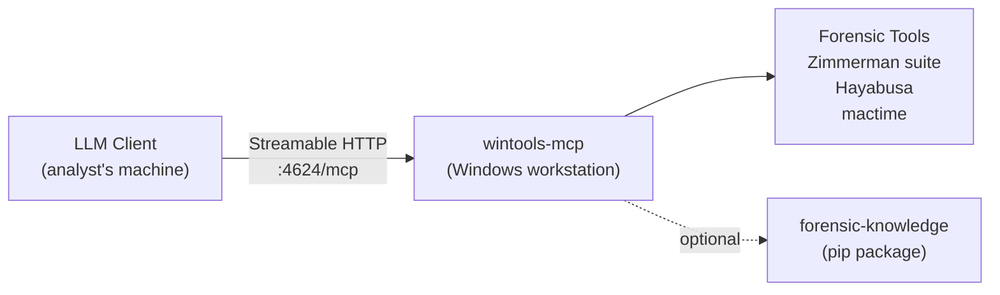
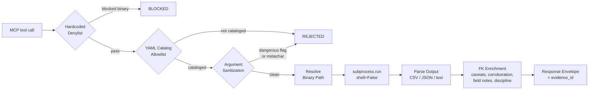
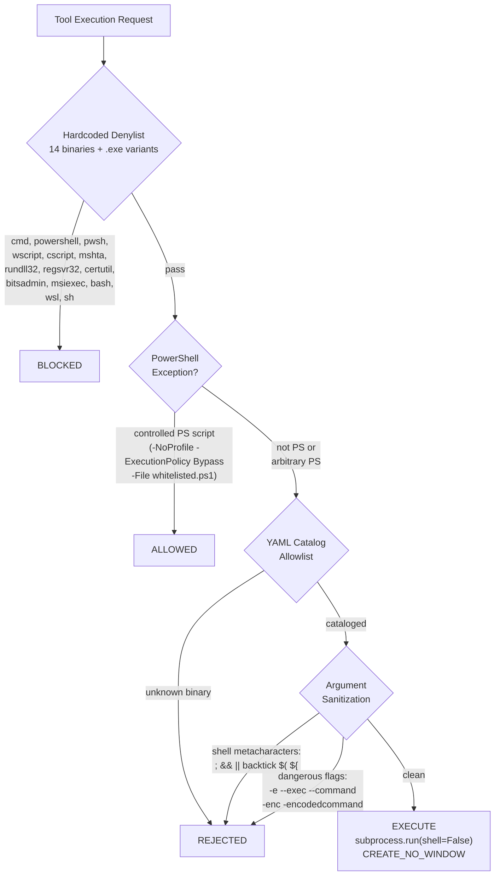

# Windows Tools MCP Server

A Model Context Protocol (MCP) server providing **catalog-gated Windows forensic tool execution with proactive artifact knowledge** for any MCP-compatible AI assistant. Runs as an independent HTTP server on a Windows forensic workstation.

## Quick Start

**On the Windows forensic workstation:**

```powershell
git clone https://github.com/AppliedIR/wintools-mcp.git
cd wintools-mcp
python -m venv .venv && .venv\Scripts\activate
pip install -e ".[fk]"
```

**Scan for installed forensic tools:**

```powershell
python -m wintools_mcp --scan
```

**Start the server:**

```powershell
python -m wintools_mcp --http --host 0.0.0.0 --port 4624
```

**On the analyst's machine, generate client config:**

```bash
aiir setup client --windows=WINDOWS_IP:4624
```

This writes the appropriate `.mcp.json` entry for your LLM client (Claude Code, Cursor, Goose, OpenCode, etc.) pointing at the Windows machine's Streamable HTTP endpoint.

**Client configuration** (`.mcp.json`):

```json
{
  "mcpServers": {
    "wintools-mcp": {
      "type": "streamable-http",
      "url": "http://WINDOWS_IP:4624/mcp"
    }
  }
}
```

**Verify installation:**

```powershell
python -c "from wintools_mcp.server import create_server; print('wintools-mcp: ready')"
```

---

## Overview

wintools-mcp wraps Windows forensic tool execution with catalog-based gating, argument sanitization, structured output parsing, audit trails, and knowledge-enriched response envelopes. It runs on a Windows forensic workstation as an independent HTTP server on port 4624, exposing `/mcp` (Streamable HTTP MCP) and `/health`. LLM clients connect directly to it over the network.

The server is completely independent of aiir-gateway and the SIFT-based MCP servers (forensic-mcp, sift-mcp, forensic-rag-mcp, windows-triage-mcp, opencti-mcp). Those run on SIFT. This runs on Windows, where the forensic tools (Zimmerman suite, Hayabusa, etc.) are installed.

When [forensic-knowledge](https://github.com/AppliedIR/forensic-knowledge) is installed (the `[fk]` pip extra), every tool response includes artifact-specific caveats, corroboration suggestions, field notes, and rotating discipline reminders.

> **Important:** All commands are executed via `subprocess.run(shell=False)` through a catalog-gated executor. Only tools defined in YAML catalog files can run. Dangerous binaries (cmd, powershell, wscript, etc.) are unconditionally blocked by a hardcoded denylist.

**Key Capabilities:**

- **Catalog-Gated Execution** -- Only tools defined in YAML catalog files can run; dangerous binaries are denylisted
- **Knowledge-Enriched Responses** -- Every result includes artifact caveats, corroboration suggestions, field notes, and common misinterpretation warnings from forensic-knowledge
- **Discipline Reminders** -- 10 rotating forensic methodology reminders appended to responses
- **Tool Discovery** -- Scan for installed tools, check availability, get install guidance for missing tools
- **Output Parsing** -- CSV, JSON, JSONL, and text parsers with automatic truncation and row limits
- **Output Management** -- Per-evidence output directories, SHA-256 hashing, file manifests
- **Audit Trail** -- Per-case JSONL audit logged to `examiners/{examiner}/audit/wintools-mcp.jsonl` when `AIIR_CASE_DIR` is set
- **Bearer Token Auth** -- Optional API key authentication for the HTTP endpoint

## Architecture

### Connection Model

LLM clients connect directly to wintools-mcp via Streamable HTTP. There is no gateway involved.



The Windows forensic workstation has the forensic tools installed locally. wintools-mcp discovers them on the filesystem, validates execution requests against the catalog, runs them via `subprocess.run(shell=False)`, parses the output, and returns structured response envelopes.

### Execution Pipeline

Every tool execution -- whether through a dedicated wrapper like `run_amcacheparser` or the generic `run_command` -- flows through the same security and enrichment pipeline.



### Security Model



**Denylist** (hardcoded, unconditional): cmd, powershell, pwsh, wscript, cscript, mshta, rundll32, regsvr32, certutil, bitsadmin, msiexec, bash, wsl, sh (and .exe variants). One controlled exception: PowerShell may execute a whitelisted `.ps1` script (currently only `Get-InjectedThreadEx.ps1`) when invoked with `-NoProfile -ExecutionPolicy Bypass -File`.

**Allowlist** (catalog-gated): After passing the denylist, a binary must exist in a YAML catalog file under `data/catalog/`. Unknown binaries are rejected.

**Argument sanitization**: All user-provided arguments are checked for shell metacharacters (`;`, `&&`, `||`, `` ` ``, `$(`, `${`) and dangerous flags (`-e`, `--exec`, `--command`, `-enc`, `-encodedcommand`, `--script`, `--invoke`).

**Execution**: All execution uses `subprocess.run(shell=False)` with `CREATE_NO_WINDOW` on Windows, forced UTF-8 encoding, and CRLF normalization.

## MCP Tools (23 total)

### Discovery (6 tools)

| Tool | Description |
|------|-------------|
| `scan_tools` | Scan for all cataloged forensic tools, report availability and install guidance |
| `list_available_tools` | List all cataloged tools with installation status, filterable by category |
| `list_missing_tools` | List tools not installed, with installation guidance and alternatives |
| `check_tools` | Check specific tools by name for availability |
| `get_tool_help` | Get tool-specific help, flags, caveats, and interpretation guidance |
| `suggest_tools` | Given an artifact type, suggest relevant tools and check availability |

### Generic Execution (1 tool)

| Tool | Description |
|------|-------------|
| `run_command` | Execute any cataloged tool with arguments. Catalog-gated: rejects commands not in the catalog. Accepts `purpose`, `timeout`, and `save_output` parameters. |

### Zimmerman Suite Wrappers (14 tools)

Each wrapper resolves the binary path, builds the command with `--csv` output, executes via the security pipeline, parses all resulting CSV files, and returns a structured response envelope with FK enrichment.

| Tool | Description |
|------|-------------|
| `run_amcacheparser` | Parse Amcache.hve for program execution evidence |
| `run_appcompatcacheparser` | Parse Application Compatibility Cache (ShimCache) from SYSTEM hive |
| `run_evtxecmd` | Parse Windows Event Log (EVTX) files |
| `run_jlecmd` | Parse Jump List files for recent file access |
| `run_lecmd` | Parse LNK (shortcut) files |
| `run_mftecmd` | Parse MFT ($MFT, $J, $SDS, $Boot) files |
| `run_pecmd` | Parse Prefetch files for program execution history |
| `run_rbcmd` | Parse Recycle Bin ($I) files |
| `run_recmd` | Parse Windows Registry hive files |
| `run_sbecmd` | Parse ShellBags for folder access history |
| `run_sqlecmd` | Parse SQLite databases (browser history, etc.) |
| `run_srumecmd` | Parse SRUM database for resource usage monitoring |
| `run_wxtcmd` | Parse Windows Timeline (ActivitiesCache.db) database |
| `run_bstrings` | Extract strings with regex pattern matching |

### Timeline Wrappers (2 tools)

| Tool | Description |
|------|-------------|
| `run_hayabusa` | Run Hayabusa for Sigma-based Windows event log analysis. Accepts `evtx_dir`, `min_level`, `output_file`, and `extra_args`. |
| `run_mactime` | Generate timeline from bodyfile (TSK mactime format). Accepts `body_file`, `date_range`, and `extra_args`. |

## Tool Catalog

Tools are defined in YAML catalog files under `data/catalog/`. The catalog currently contains **16 tool entries** across 2 files:

- `zimmerman.yaml` -- 14 tools (AmcacheParser, AppCompatCacheParser, EvtxECmd, JLECmd, LECmd, MFTECmd, PECmd, RBCmd, RECmd, SBECmd, SQLECmd, SrumECmd, WxTCmd, bstrings)
- `timeline.yaml` -- 2 tools (Hayabusa, mactime)

Each catalog entry defines the binary name, input style, output format, timeout, FK knowledge name, install methods, and search paths:

```yaml
# data/catalog/zimmerman.yaml (excerpt)
category: zimmerman
tools:
  - name: AmcacheParser
    binary: AmcacheParser.exe
    description: "Parse Amcache.hve for program execution evidence"
    input_flag: "-f"
    output_format: csv
    timeout_seconds: 300
    fk_tool_name: AmcacheParser
    install_methods:
      - method: direct
        url: "https://ericzimmerman.github.io/#!index.md"
      - method: dotnet
        command: "dotnet tool install --global AmcacheParser"
    install_paths:
      - "C:\\Tools\\ZimmermanTools"
```

## Response Envelope

Every tool response is wrapped in a structured envelope:

```json
{
  "success": true,
  "tool": "run_amcacheparser",
  "data": {"Amcache_UnassociatedFileEntries": {"rows": [...], "total_rows": 42, "columns": [...]}},
  "output_format": "parsed_csv",
  "evidence_id": "win-steve-20260220-001",
  "examiner": "steve",
  "caveats": [
    "Amcache entries indicate installation, not necessarily execution",
    "Timestamps reflect installation time, not last run"
  ],
  "advisories": ["Cross-reference with Prefetch for execution confirmation"],
  "corroboration": {
    "artifacts": ["prefetch", "shimcache"],
    "tools": ["PECmd", "AppCompatCacheParser"]
  },
  "field_notes": {"KeyLastWriteTimestamp": "Last time the registry key was modified"},
  "discipline_reminder": "Evidence is sovereign -- if results conflict with your hypothesis, revise the hypothesis, never reinterpret evidence to fit",
  "metadata": {
    "elapsed_seconds": 1.23,
    "exit_code": 0,
    "command": ["AmcacheParser.exe", "-f", "Amcache.hve", "--csv", "C:\\Cases\\output"]
  }
}
```

| Field | Source | Description |
|-------|--------|-------------|
| `evidence_id` | Audit | Unique identifier (`win-{examiner}-{YYYYMMDD}-{NNN}`) for referencing in case findings |
| `caveats` | forensic-knowledge | Artifact-specific limitations and interpretation warnings |
| `advisories` | forensic-knowledge | Usage guidance, "does not prove" warnings, and common misinterpretation corrections |
| `corroboration` | forensic-knowledge | Suggested cross-reference artifacts and tools for validation |
| `field_notes` | forensic-knowledge | Timestamp field meanings from artifact definitions |
| `discipline_reminder` | Built-in | Rotating forensic methodology reminder (10 reminders, cycled per call) |
| `output_files` | Output manager | File manifest with paths, sizes, and SHA-256 hashes (when working_dir is set) |

## Configuration

### Environment Variables

| Variable | Default | Description |
|----------|---------|-------------|
| `WINTOOLS_TIMEOUT` | `600` | Default command timeout in seconds |
| `WINTOOLS_HOST` | `127.0.0.1` | HTTP server bind address |
| `WINTOOLS_PORT` | `4624` | HTTP server port |
| `WINTOOLS_TOOL_PATHS` | (none) | Additional binary search directories (path-separated) |
| `WINTOOLS_CATALOG_DIR` | (auto) | Override path to catalog YAML directory |
| `AIIR_CASE_DIR` | (none) | Active case directory; enables per-case audit trail |
| `AIIR_ACTIVE_CASE` | (none) | Case identifier recorded in audit entries |
| `AIIR_EXAMINER` | OS user | Examiner identity (lowercase slug, immutable after startup) |
| `AIIR_ANALYST` | (none) | Deprecated alias for `AIIR_EXAMINER` |

### YAML Config File

Pass via `--config path/to/config.yaml`. Environment variables override YAML values.

| Key | Default | Description |
|-----|---------|-------------|
| `default_timeout` | `600` | Subprocess timeout in seconds |
| `max_output_bytes` | `50000` | Output truncation threshold |
| `http_host` | `127.0.0.1` | HTTP bind address |
| `http_port` | `4624` | HTTP port |
| `hayabusa_dir` | `C:\Tools\Hayabusa` | Hayabusa installation directory |
| `tool_paths` | `[]` | Additional binary search directories |
| `api_keys` | `{}` | API keys for HTTP mode Bearer token authentication |
| `file_transfer_enabled` | `true` | Enable file transfer support |
| `working_dir` | (none) | Working directory for output files |
| `max_upload_bytes` | `2147483648` | Maximum upload size (2 GB) |
| `catalog_dir` | (auto) | Override path to catalog YAML directory |

### Binary Search Order

When resolving a tool binary, wintools-mcp searches in this order:

1. System PATH (`shutil.which`)
2. Default tool paths:
   - `C:\Program Files`, `C:\Program Files (x86)`, `%LOCALAPPDATA%\Programs`
   - `C:\Tools`, `C:\Tools\ZimmermanTools`, `C:\Tools\Hayabusa`
   - `C:\Tools\SleuthKit\bin`, `C:\Tools\Volatility3`, `C:\Tools\KAPE`
   - `C:\Tools\MemProcFS`, `C:\Tools\Moneta`, `C:\Tools\HollowsHunter`, `C:\Tools\CAPA`
   - `%USERPROFILE%\Desktop\ZimmermanTools`
   - `C:\ProgramData\chocolatey\bin` (Chocolatey)
   - `%USERPROFILE%\scoop\shims` (Scoop)
3. Extra paths from `WINTOOLS_TOOL_PATHS` env var or `tool_paths` config

## HTTP Server

wintools-mcp runs as an HTTP server using Starlette + uvicorn:

```powershell
python -m wintools_mcp --http --host 0.0.0.0 --port 4624
```

The server exposes two endpoints:

| Endpoint | Method | Description |
|----------|--------|-------------|
| `/mcp` | POST | MCP Streamable HTTP endpoint (for LLM clients) |
| `/health` | GET | Health check, returns `{"status": "ok", "service": "wintools-mcp"}` |

### Authentication

When `api_keys` is configured (via YAML config), all `/mcp` requests require a Bearer token:

```
Authorization: Bearer <api-key>
```

Each key maps to an examiner identity and role. Without `api_keys` configured, the server runs in anonymous mode.

### DNS Rebinding Protection

The HTTP server inherits FastMCP's allowed-hosts protection. When binding to `0.0.0.0` or a specific IP, that host is automatically added to the allowed list.

## Case Audit Trail

When `AIIR_CASE_DIR` is set, every tool execution is logged to `examiners/{examiner}/audit/wintools-mcp.jsonl`:

```json
{
  "ts": "2026-02-20T14:30:00+00:00",
  "mcp": "wintools-mcp",
  "tool": "run_amcacheparser",
  "evidence_id": "win-steve-20260220-001",
  "examiner": "steve",
  "case_id": "INC-2026-001",
  "source": "mcp_server",
  "params": {"input_file": "Amcache.hve", "output_dir": "C:\\Cases\\output"},
  "result_summary": {"exit_code": 0, "csv_files": 3},
  "elapsed_ms": 1230.5
}
```

Evidence IDs follow the format `win-{examiner}-{YYYYMMDD}-{NNN}` and resume sequence numbering across process restarts by scanning existing audit entries.

When `AIIR_CASE_DIR` is not set, audit logging is silently skipped. Evidence IDs are still generated for response envelopes.

## Project Structure

```
wintools-mcp/
├── src/wintools_mcp/
│   ├── __init__.py              # Package version
│   ├── __main__.py              # Entry point (--http, --scan, --config)
│   ├── server.py                # FastMCP server with 23 registered tools
│   ├── catalog.py               # YAML catalog loader, denylist, allowlist, PS exceptions
│   ├── config.py                # Configuration from env vars + YAML, examiner identity
│   ├── environment.py           # Binary discovery across PATH + default tool paths
│   ├── security.py              # Argument sanitization (metacharacters, dangerous flags)
│   ├── executor.py              # subprocess.run wrapper (shell=False, UTF-8, CRLF normalization)
│   ├── response.py              # FK-enriched response envelope builder
│   ├── output.py                # Per-evidence output directories and file manifests
│   ├── exceptions.py            # Exception hierarchy (DenylistError, ToolNotInCatalogError, etc.)
│   ├── inventory.py             # Tool scanning, install guidance, --scan report
│   ├── audit.py                 # Per-case JSONL audit writer with sequence resumption
│   ├── http_server.py           # Starlette HTTP app (/mcp + /health + Bearer auth)
│   ├── parsers/
│   │   ├── csv_parser.py        # CSV parsing with row limits and truncation
│   │   ├── json_parser.py       # JSON and JSONL parsing with entry limits
│   │   └── text_parser.py       # Plain text parsing with line limits
│   └── tools/
│       ├── discovery.py         # scan_tools, list_available_tools, check_tools, suggest_tools, get_tool_help
│       ├── generic.py           # run_command (catalog-gated generic execution)
│       ├── zimmerman.py         # 14 Zimmerman suite wrappers with CSV output parsing
│       └── timeline.py          # run_hayabusa, run_mactime
├── data/catalog/
│   ├── zimmerman.yaml           # 14 Zimmerman tool definitions
│   └── timeline.yaml            # Hayabusa + mactime definitions
├── tests/                       # 125 tests across 13 test files
├── pyproject.toml
└── README.md
```

## Development

```powershell
# Install with dev dependencies
pip install -e ".[fk,dev]"

# Run tests
.venv\Scripts\pytest tests/ -v

# Run with coverage
.venv\Scripts\pytest tests/ --cov=wintools_mcp --cov-report=term-missing
```

## Responsible Use

This tool is designed to assist trained forensic analysts, not replace them. Tool execution results require the same verification as any other forensic tool output.

**Core principles:**

- **Human authority is final.** Every finding and conclusion must be reviewed and approved by a qualified analyst before it becomes part of the case record.
- **Evidence before claims.** All conclusions must reference actual evidence. Unsupported claims are structurally rejected by the platform.
- **The analyst owns the work product.** AI assistance does not reduce the analyst's responsibility for accuracy, completeness, or defensibility of conclusions.
- **AI output requires the same scrutiny as any other tool.** Treat AI-proposed findings the same way you would treat output from any forensic tool: verify, corroborate, and document.
- **Absence of evidence is not evidence of absence.** The platform guards against premature exclusion and confirmation bias, but the human analyst is the last line of defense.

## Acknowledgments

Architecture and direction by Steve Anson. Implementation by Claude Code (Anthropic).

## License

MIT License. See [LICENSE](LICENSE) for details.
